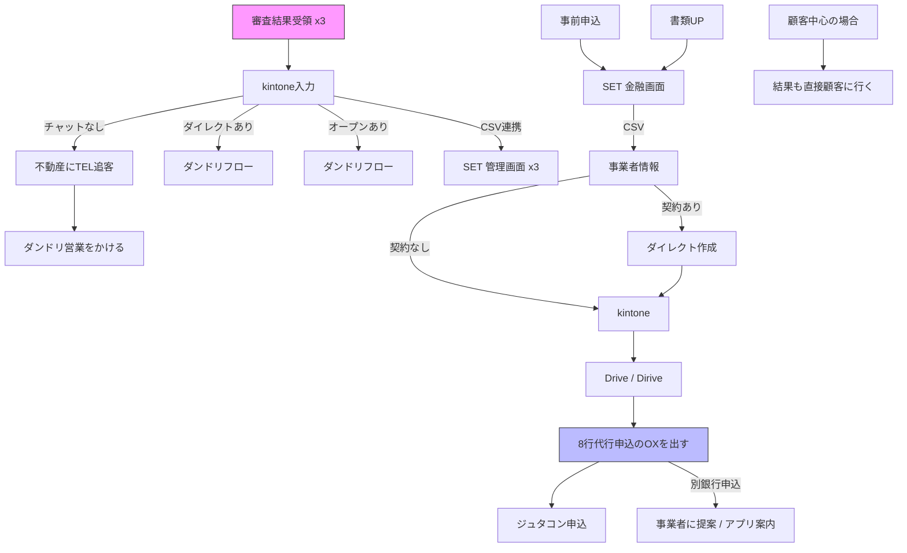

# 審査・申込フロー図

```mermaid
graph TD
    %% 画像1のフロー
    Start["審査結果受領 x3"] --> Kintone["kintone入力"]

    Kintone -->|チャットなし| RealEstate["不動産にTEL追客"]
    RealEstate --> Sales["ダンドリ営業をかける"]

    Kintone -->|ダイレクトあり| Flow1["ダンドリフロー"]
    Kintone -->|オープンあり| Flow2["ダンドリフロー"]

    Kintone -->|CSV連携| SET_Admin["SET 管理画面 x3"]

    %% 画像2のフロー
    PreApply["事前申込"] --> SET_Fin["SET 金融画面"]
    Documents["書類UP"] --> SET_Fin

    SET_Fin -->|CSV| BizInfo["事業者情報"]

    BizInfo -->|契約なし| Kintone2["kintone"]
    BizInfo -->|契約あり| Direct["ダイレクト作成"]
    Direct --> Kintone2

    Kintone2 --> Drive["Drive / Dirive"]
    Drive --> BankOX["8行代行申込のOXを出す"]

    BankOX --> Juta["ジュタコン申込"]
    BankOX -->|別銀行申込| Suggest["事業者に提案 / アプリ案内"]

    %% 特殊ケース
    CustomerCenter["顧客中心の場合"] --> ResultDirect["結果も直接顧客に行く"]

    %% スタイル
    style Start fill:#f9f,stroke:#333
    style BankOX fill:#bbf,stroke:#333
```
